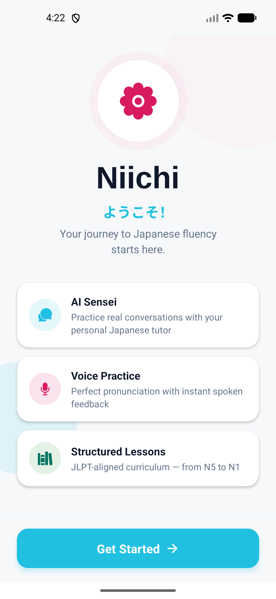
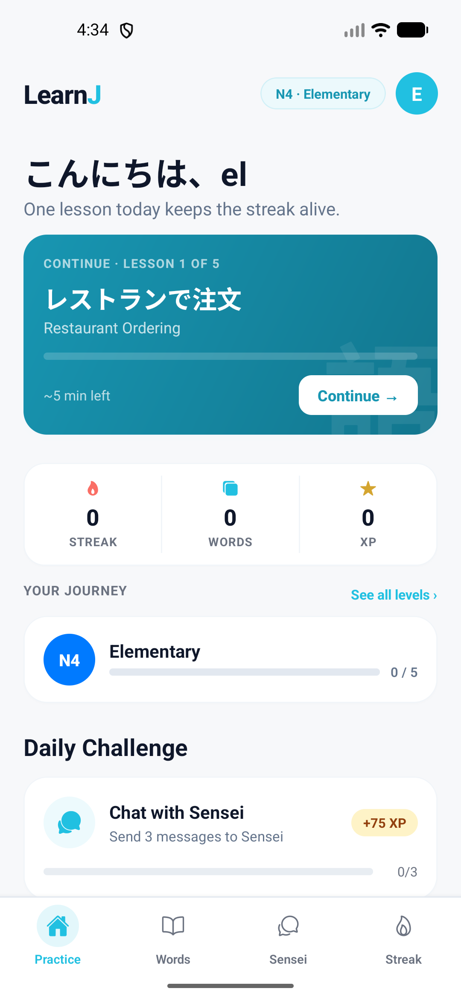
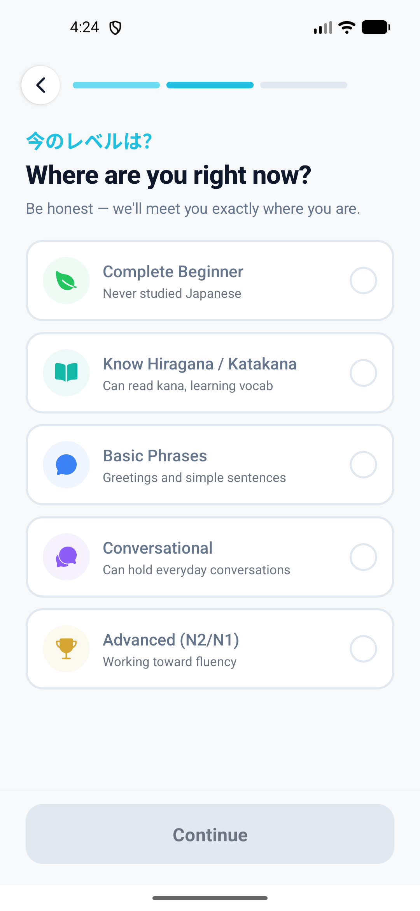
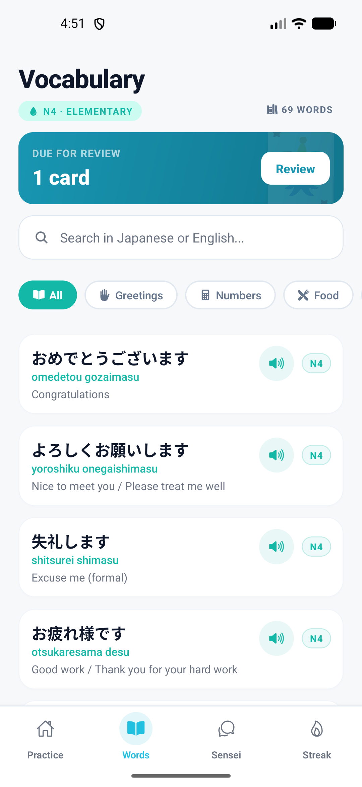
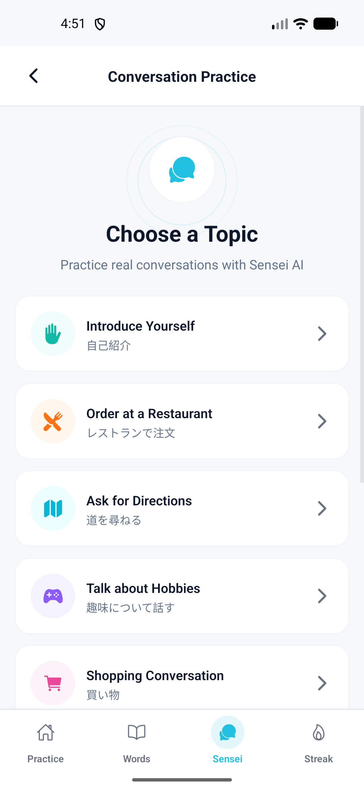
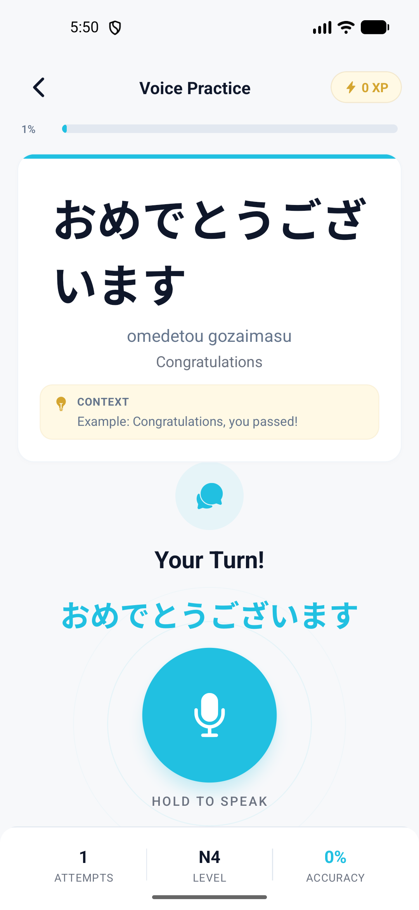

# Niichi — Learn Japanese, Naturally 🌸

> **This is a public overview repository.** It showcases what the app does, its
> feature set, and its user interface. It intentionally contains **no source
> code, API keys, database schema, or other proprietary material** — only a
> high-level description and screenshots.

Niichi is a mobile app for learning Japanese through AI-powered conversation,
voice practice, spaced-repetition vocabulary, and a structured, JLPT-aligned
curriculum (N5 → N1). It's designed to feel calm and conversational rather than
gamey-for-the-sake-of-it, while still keeping you motivated with streaks, XP,
and daily challenges.

---

## ✨ What it does

### 🗣️ AI Sensei — Conversation Practice
Practice real conversations with an AI Japanese tutor across guided topics —
*Introduce Yourself*, *Order at a Restaurant*, *Ask for Directions*, *Talk About
Hobbies*, *Shopping*, and more. Each topic adapts to your level and keeps the
dialogue natural.

### 🎤 Voice Practice
Hear native-style pronunciation, then hold to speak and get instant feedback on
your own pronunciation — with attempt count, level, and an accuracy score so you
can track improvement phrase by phrase.

### 🎧 Shadowing
A dedicated shadowing player for the classic listen-and-repeat technique to
build natural rhythm, intonation, and fluency.

### 📚 Vocabulary + Spaced Repetition (SRS)
A searchable vocabulary library organized by JLPT level and category
(Greetings, Numbers, Food, and more). Words surface for review using a
spaced-repetition schedule, with tap-to-hear audio for every entry.

### 🎯 Structured Lessons
A JLPT-aligned curriculum from absolute beginner to advanced, broken into short,
focused lessons (e.g. *Restaurant Ordering*) that fit into a few minutes a day.

### 💼 Business Japanese Path
A dedicated track for learners who need practical, workplace-ready Japanese.

### 📈 Progress & Motivation
- Daily streaks and a "one lesson keeps the streak alive" daily nudge
- XP, level-ups, and celebration moments
- Daily challenges (e.g. *Chat with Sensei — send 3 messages*)
- A clear "Your Journey" map across JLPT levels
- Unlockable cosmetics and personal study goals

### 🚀 Personalized Onboarding
A short, friendly onboarding flow: set your goal, honestly pick your current
level, make a small commitment, and receive a personalized study plan before you
begin.

### 👤 Profile, Settings & Privacy
Account profile, study preferences, and full legal coverage — Privacy Policy,
Terms of Service, Data Safety, and in-app Support.

---

## 📱 Screenshots

| Welcome | Home | Lessons |
|:---:|:---:|:---:|
|  |  |  |

| Vocabulary | AI Sensei | Voice Practice |
|:---:|:---:|:---:|
|  |  |  |

> Some early screenshots show the app's previous name ("LearnJ") — it has since
> been rebranded to **Niichi**.

---

## 🧱 Tech Stack (high level)

- **Mobile:** React Native + Expo, TypeScript
- **Navigation:** React Navigation
- **State:** Zustand
- **Backend:** Supabase (auth + database)
- **AI:** Conversational tutoring powered by a large language model
- **Speech:** On-device Text-to-Speech and Speech Recognition
- **Build/Release:** EAS (iOS & Android)

---

## 🎨 Design

A clean, minimalist interface built around a calming cyan accent and a sakura
(cherry-blossom) motif. The UI favors generous whitespace, large readable
Japanese type, and gentle motivation over clutter — so the focus stays on
learning.

---

## ℹ️ About this repo

This repository is a **showcase / portfolio overview only**. The application's
source code, configuration, credentials, and backend are private and are **not**
included here. For inquiries, please reach out through the contact details on the
project's store listing.

---

Built with ❤️ for Japanese learners everywhere 🇯🇵
